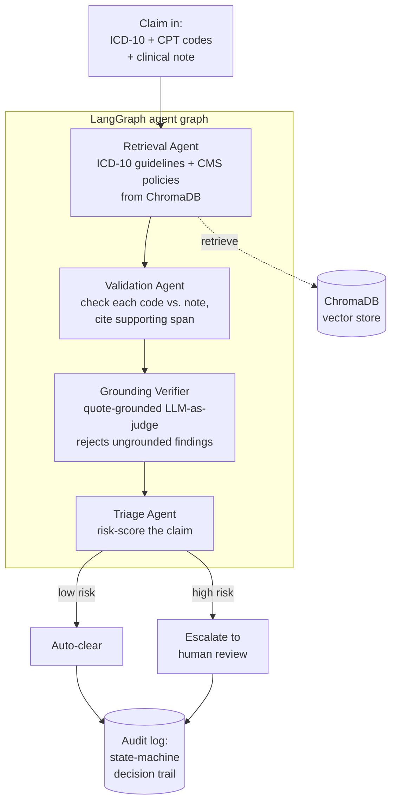

# AuditPilot

**A multi-agent system that validates whether the billed ICD-10/CPT codes on a
medical claim are actually supported by the clinical documentation.**

> **Project status: scaffold.** This repository currently contains documented
> stubs (docstrings, signatures, and `# TODO` markers) that define the
> structure and contracts of the system. Agent logic is **not yet implemented**.

---

## Problem statement

Healthcare claims are reimbursed based on diagnosis (ICD-10) and procedure (CPT)
codes. When a billed code is not supported by the underlying clinical note, the
claim is at risk of denial, clawback, or — in the aggregate — compliance
exposure. Manual coding audits are accurate but slow and expensive, so payers
and providers can only review a small sample of claims.

AuditPilot automates the first pass. For each claim it:

1. **Retrieves** the relevant coding guidance — ICD-10 Official Guidelines and
   CMS coverage policies — from a vector store.
2. **Validates** each billed code against the clinical note, citing the specific
   guidance and the note text that supports (or contradicts) the code.
3. **Verifies grounding** with a quote-grounded LLM-as-judge that *rejects any
   finding not tied to a verbatim source span* in the clinical note or guidance.
4. **Triages** the claim with a risk score, then **auto-clears** low-risk claims
   or **escalates** high-risk claims to human review.

The goal is to concentrate scarce human auditor time on the claims most likely
to be miscoded, while leaving an auditable, source-grounded trail for every
decision.

---

## ⚠️ Data caveat (important)

This project uses **[Synthea](https://github.com/synthetichealth/synthea)**
synthetic patient records. Synthea generates records that are *internally
consistent* — the codes it emits already match the conditions it modeled — so
Synthea on its own contains **no coding errors** and therefore **no labels** to
detect.

To create a supervised, evaluable task, AuditPilot **synthetically injects
coding errors** into the Synthea records and records the injected mutation as
**ground-truth labels**. Injected error types include:

- **Upcoding** — swapping a billed code for a higher-acuity / higher-reimbursement code not supported by the note.
- **Unsupported procedure** — adding a CPT procedure code with no corresponding documentation.
- **Missing documentation** — billing a diagnosis whose supporting clinical detail has been removed from the note.

**Consequence:** evaluation metrics reflect performance against *this synthetic
error distribution*, not real-world payer claims. Results are a portfolio /
methodology demonstration, **not** a clinically or actuarially validated
benchmark. See [data/README.md](data/README.md) for the injection methodology.

---

## Architecture

Four agents are assembled into a LangGraph state graph. The first cut is a
linear pipeline; conditional routing (e.g. skipping triage escalation for
clean claims, or looping back on low-confidence retrieval) is marked as TODO.



| Agent | Module | Responsibility |
|-------|--------|----------------|
| Retrieval | [agents/retrieval_agent.py](agents/retrieval_agent.py) | Pull relevant ICD-10 guidelines + CMS policy chunks from ChromaDB. |
| Validation | [agents/validation_agent.py](agents/validation_agent.py) | Judge each billed code against the note; produce findings with cited spans. |
| Grounding verifier | [agents/grounding_verifier.py](agents/grounding_verifier.py) | LLM-as-judge that drops any finding whose citation is not a verbatim source span. |
| Triage | [agents/triage_agent.py](agents/triage_agent.py) | Risk-score the claim and decide auto-clear vs. escalate. |

---

## Repository layout

```
AuditPilot/
├── app.py                  # Gradio demo entry point (HF Spaces expects this)
├── api/                    # FastAPI service
│   └── main.py
├── agents/                 # The four agents (one module each)
│   ├── retrieval_agent.py
│   ├── validation_agent.py
│   ├── grounding_verifier.py
│   └── triage_agent.py
├── graph/                  # LangGraph state + graph assembly
│   ├── state.py
│   └── build_graph.py
├── knowledge_base/         # Chunk + embed ICD-10 / CMS docs into ChromaDB
│   └── ingest.py
├── data/                   # Synthea generation notes + error injection
│   ├── README.md
│   └── inject_errors.py
├── eval/                   # Eval harness (precision@k, grounding, business $)
│   └── harness.py
├── audit_log/              # Decision-logging state-machine utility
│   └── logger.py
├── requirements.txt
├── Dockerfile
├── .env.example
└── LICENSE
```

---

## Setup

> The pipeline is not implemented yet; these steps prepare the environment so
> modules can be filled in.

```bash
# 1. Clone
git clone https://github.com/charanyellanki/AuditPilot.git
cd AuditPilot

# 2. Create a virtual environment (Python 3.11)
python -m venv .venv
source .venv/bin/activate        # Windows: .venv\Scripts\activate

# 3. Install dependencies
pip install -r requirements.txt

# 4. Configure secrets
cp .env.example .env             # then fill in your API key(s)
```

Planned workflow once implemented:

```bash
# Generate + label data (see data/README.md for Synthea setup)
python -m data.inject_errors

# Build the knowledge base (chunk + embed guidance into ChromaDB)
python -m knowledge_base.ingest

# Run the evaluation harness
python -m eval.harness

# Launch the demo UI
python app.py

# Or run the API
uvicorn api.main:app --reload
```

### Docker

```bash
docker build -t auditpilot .
docker run -p 7860:7860 --env-file .env auditpilot   # Gradio demo
```

---

## Evaluation (planned)

The harness in [eval/harness.py](eval/harness.py) tracks, via MLflow:

- **Precision@k** of flagged coding errors against the injected ground truth.
- **Grounding faithfulness** — fraction of surfaced findings backed by a valid verbatim source span.
- **Business readout** — estimated recovery dollars and human review-hours saved
  under a configurable auto-clear threshold (illustrative, on synthetic data).

---

## Tech stack

Python 3.11 · LangGraph · ChromaDB · FastAPI · Gradio · MLflow · Docker.
LLM calls go through a hosted API (Anthropic / OpenAI) — there is **no local
model in the demo path**.

## License

[MIT](LICENSE)
